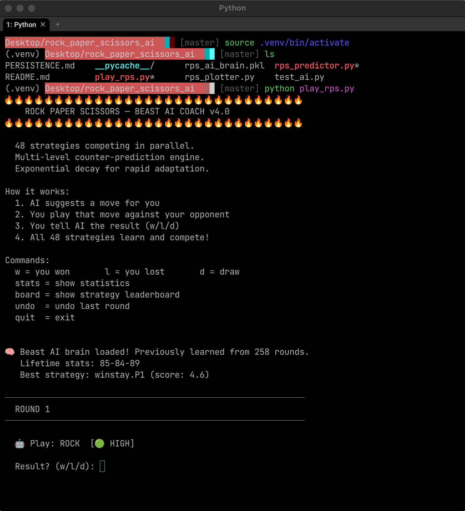
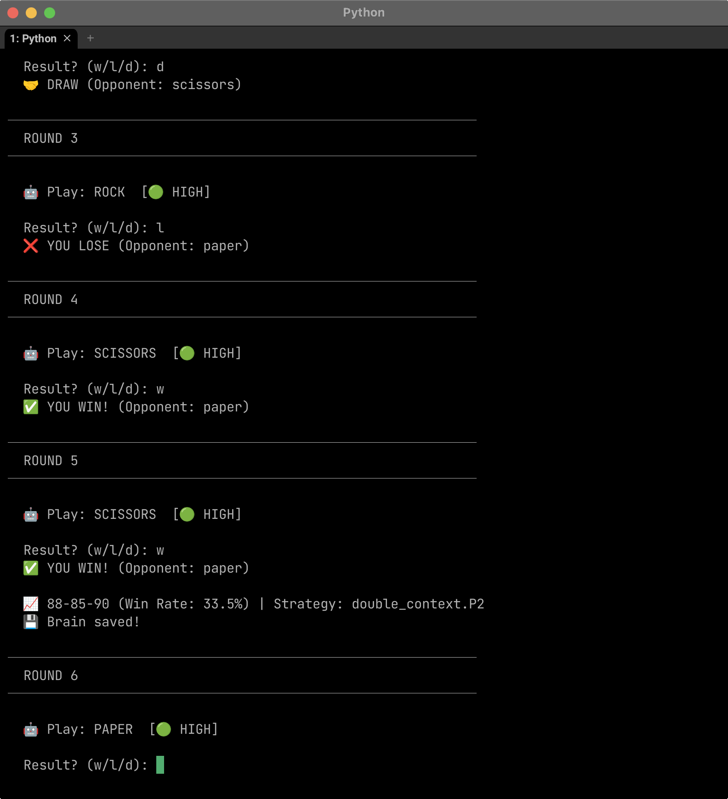

# Rock Paper Scissors — Beast AI Coach

A terminal-based Rock Paper Scissors coach that watches your opponent's patterns and tells you what to play. You feed it results, it figures out what your opponent is doing, and it gets better over time.

> **Heads up** — this started as an attempt to beat Stake's RPS. Honestly, it works more often than I expected. That said, it's not a money printer — Stake's AI adapts, and when it does you'll start losing. Then this AI adapts back. It's a cat and mouse thing. Win when you're the cat, and stick to gold coins when you're the mouse.

---

## What it does

- Runs **48 strategies in parallel** — they all compete, and the best-performing one calls the shots at any given moment
- Picks up on patterns fast — usually within **5–10 rounds**
- Saves its brain between sessions so it picks up where it left off
- Shows you its **confidence level** with every suggestion (green dot = high, yellow = medium)
- Falls back to randomness when it's unsure, so it doesn't get exploited
- Tracks lifetime stats across all your sessions

---

## Screenshots

**Starting the game — the AI loads its saved brain and jumps straight in:**



**Mid-session — the AI coaching you round by round with confidence indicators:**



---

## Getting started

```bash
python3 play_rps.py
```

That's it. The AI will greet you, load any previously saved session data, and start suggesting moves right away.

For extra output showing what strategies are doing what internally:
```bash
python3 play_rps.py --verbose
```

---

## How a session goes

1. The AI tells you what to play — e.g. `🤖 Play: ROCK [🟢 HIGH]`
2. You play that against your opponent
3. You type `w`, `l`, or `d` depending on what happened
4. Repeat — the AI keeps learning and adjusting

**Available commands during play:**

| Command | What it does |
|---------|--------------|
| `w` | You won that round |
| `l` | You lost that round |
| `d` | Draw |
| `stats` | Show win/loss breakdown |
| `board` | Show the strategy leaderboard |
| `undo` | Undo the last round |
| `quit` | Exit |

---

## Performance (100 rounds each)

| Opponent type | Win rate | Notes |
|--------------|----------|-------|
| Pattern-based | **93%** | Rigid sequences like R-P-S-S-P |
| Frequency bias | **73%** | Opponents that heavily favor one move |
| Counter-AI | **61%** | Opponents actively trying to counter you |
| Win-Stay/Lose-Shift | **38%** | Adapts after each round |
| Random | **38%** | Expected is ~33%, so a slight edge |

---

## How it actually works

Under the hood there are 48 prediction strategies running at the same time — things like n-gram pattern matching, Markov chain transition tracking, win-stay/lose-shift detection, anti-repetition bias modeling, and frequency analysis. Each strategy gets a score based on how well it's been predicting recently, and a weighted vote determines what move gets suggested.

When no strategy is confident enough, it falls back to random (Nash equilibrium) so the AI doesn't develop predictable habits of its own.

The brain is saved to `rps_ai_brain.pkl` after every round, so your session data carries over next time.

---

## Files

- `rps_predictor.py` — the core AI engine, where all 48 strategies live
- `play_rps.py` — the coaching interface you actually run
- `test_ai.py` — test suite for running the AI against simulated opponents

---

## Running tests

```bash
# Run against all opponent types
python3 test_ai.py --strategy all --rounds 100

# Run against a specific opponent type
python3 test_ai.py --strategy pattern --rounds 50
```

Available strategies: `random`, `pattern`, `frequency`, `win-stay`, `counter`

---

No ML libraries needed — just Python.